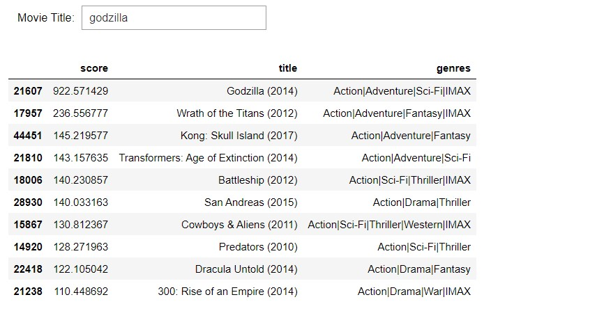

A simple movie recommendation system based on the ratings and that of the movies watched by the users with similar interests(movie titles and ratings) like us which was made using python and pandas. The dataset consists of movies upto 2019.

 - Output:
  
  -->For the movie title "godfather"
  
  

  --> For the movie title "godzilla"

    

